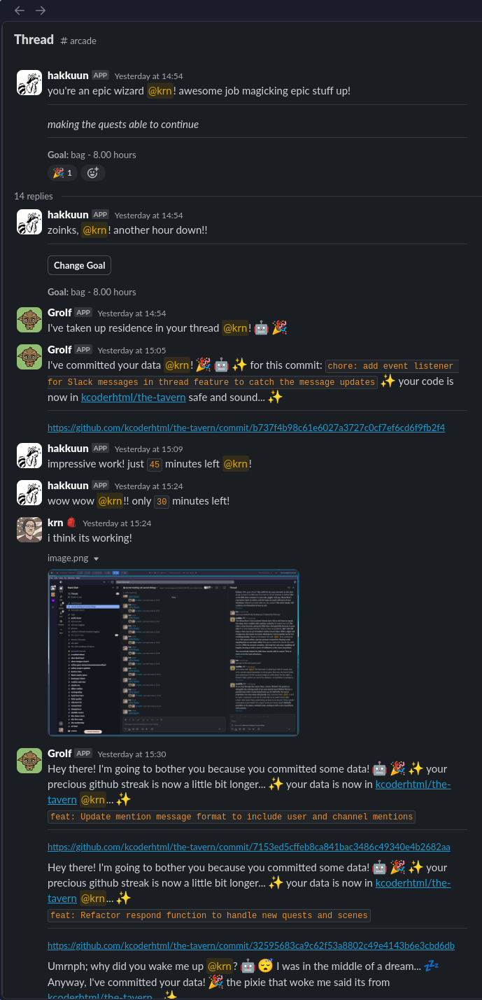
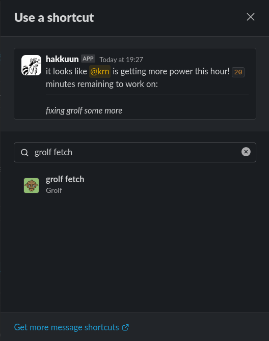
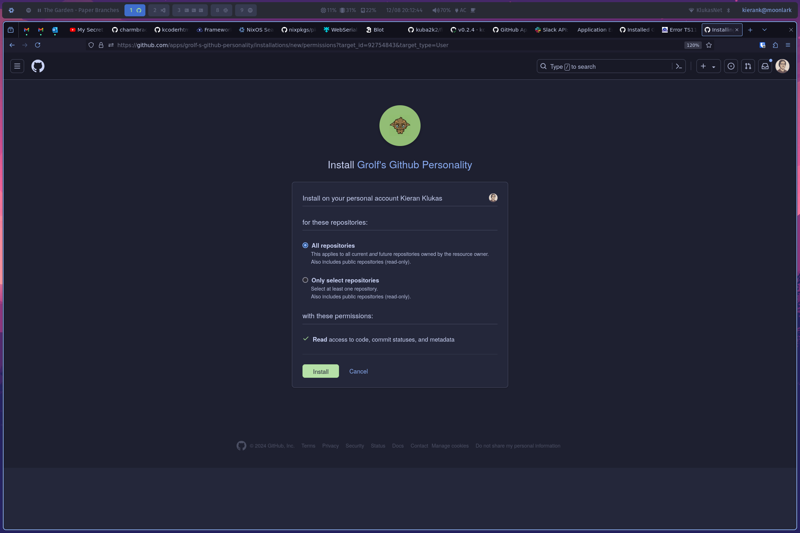

# grolf arcade bot

Your friendly lightweight arcade helper written in Bun and hosted on nest! 😎


If you've never used grolf before and are curious what it is then here's the TDLR: Grolf is a slack app that acts as an air traffic control room basicaly for your github commits. It takes in webhooks from github for every commit you push to github and then redirects them to the proper arcade thread on slack. It also has pretty graphs all made out of asci and a super nice logging system originaly developed by [@jaspermayone](https://github.com/jaspermayone) for the https://github.com/hackclub/arcadius and https://github.com/hackclub/professor-bloom slack bots.

_Claim to fame: I demoed this to the founder of Github!_

## Usage on slack

<details>
  <summary>Expand here for the first time setup instructions on the slack side (if you want to know how to use the bot this is for you)</summary>

  <br/>

  First you need to create a new arcade session like below:  
    
  Next click the three dots next to your thread's top message  
    
  Now click the message shortcuts button and search for `fetch grolf` in the popup  
    
  Now click the fetch grolf shortcut and follow the instructions grolf gives you to authorize your acount with github (if there was a database reset and you need to do this again then enter your github username in the popup follow the link displayed to install grolf and then delete the grolf app from your github acount then reinstall it acording to grolf's instructions)  
    
  When installing the grolf app I recommend checking all repositories so that grolf will just work regardless of what you are working on but you can also chose specific repositories if you feel more comfortable that way.  
    
  Grolf will now send a message in your arcade thread and you are good to go!  
    
</details>  

<br/>

If you ever need to change your github username and update that in grolf then just run the command `/tellgrolf` and follow the instructions  

## Creating the apps

You need a slack app with the following manifest

```yaml
display_information:
  name: Grolf
  description: This grolf has a special Fähigkeiten which is to grab your git commits and plop them somewhere
  background_color: "#203020"
  long_description: They call me Grolf, though whispers in the forest say I'm born from moonlight and fallen leaves. I wouldn't know, honestly, my memories start with the damp earth and the sweet smell of moss. I'm not much to look at, a furry green fellow with a single, bright leaf sprouting from my back. But don't let that fool you! Lately, I feel a strange pull towards the programmers' world, a place buzzing with light and strange symbols. Sometimes, I can't resist grabbing a sparkly wisp of code from their machines and dropping it right in their online hangout. They get flustered, these programmers, but hey, a little chaos never hurt anyone, right? Besides, who knows, maybe they'll find a missing piece of their puzzle in my little gifts.
features:
  bot_user:
    display_name: Grolf
    always_online: false
  shortcuts:
    - name: grolf fetch
      type: message
      callback_id: fetch
      description: Send grolf to go gather your commits and return with them to this thread!
  slash_commands:
    - command: /tellgrolf
      url: https://casual-renewing-reptile.ngrok-free.app/slack
      description: Tell grolf you want to change your user name!
      should_escape: false
oauth_config:
  scopes:
    bot:
      - chat:write
      - chat:write.public
      - commands
      - links:write
      - users.profile:read
      - users:read
settings:
  interactivity:
    is_enabled: true
    request_url: https://your-app-url.ngrok-free.app/slack
  org_deploy_enabled: false
  socket_mode_enabled: false
  token_rotation_enabled: false
```

and a github app with the commit status and contents permissions as well as the mandatory metadata permission. You also need to configure the app webhook to send events to `https://your-app-url.ngrok-free.app/gh` as well as the callback url to `https://your-app-url.ngrok-free.app/gh`

## Installing

Install the dependencies first

```bash
bun install
```

### Running the Slackbot

First migrate the db so you have a local copy of the database then you can run the dev script to start the server!

```bash
bunx prisma migrate dev --name db
bun run dev
```

You probably also want to run the ngrok tunnel so that your slackbot can get events from slack (double check the package.json to make sure that you changed the url to your ngrok url)

```bash
bun run ngrok
```

## Development

### Database

If you change the schema.prisma file you will need to run the following command to update the database schema

```bash
bunx prisma migrate dev
```

alternatively you can use the db push command which is a more prod friendly command

```bash
bunx prisma db push
```

## Production

Use the docker-compose file to run the app in production

```bash
docker-compose up -d
```

## Screenshots


---

_© 2024 Kieran Klukas_  
_Licensed under [AGPL 3.0](LICENSE.md)_
